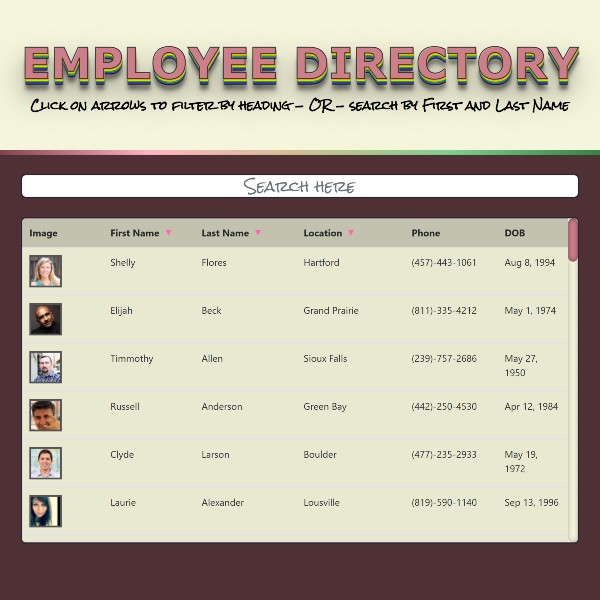

# [19-user-directory](https://michellemcconville.github.io/19-user-directory/) 🔗


## Description

A simple full stack react Employee Directory App

- ***NOTE:*** This project was bootstrapped with Create React App

| ***Screenshot***                   |
| :--------------------------------: |
|  |

## Table of Contents ✨

- [Installation](#installation)
- [Usage](#usage)
- [Contributing](#contributing)
- [Tests](#tests)
- [Questions](#questions)
- [License](#license)

## Installation 🛠️ <a name="installation"></a>

```node
Type the following command inside the Integrated Terminal:
  1. yarn install
```

## Usage ⚙️ <a name="usage"></a>

```.
Select the link below & enjoy!
```

> [Click to go to App](https://michellemcconville.github.io/19-user-directory/) 🔗

```.
OR to Run Locally
```

### `yarn start`

Runs the app in the development mode.\
Open [http://localhost:3000](http://localhost:3000) to view it in the browser.

The page will reload if you make edits.\
You will also see any lint errors in the console.

## Contributing 🤝 <a name="contributing"></a>

All contributions must be approved by owner

## Tests ✅ <a name="tests"></a>

### `yarn test`

Launches the test runner in the interactive watch mode.\
See the section about [running tests](https://facebook.github.io/create-react-app/docs/running-tests) for more information.

## Questions ❓ <a name="questions"></a>

* 📧 If you have any questions please [**eMail**](mailto:dev.mchel@gmail.com) me
* :octocat: Check out more of my work on [**GitHub**](https://github.com/MichelleMcConville)

## License 📝 <a name="license"></a>

This project is **`General Public License v3.0`** licensed

---

 Copyright ©️ 2021 🌷 Michelle McConville
